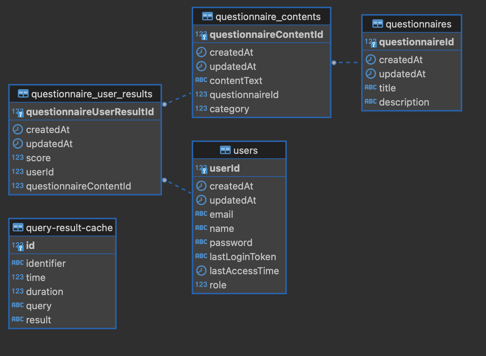

# futureplay_assignment

## 백그라운드 세팅

0. node v18.17.0 버전과 docker-desktop을 미리 설치하기 docker 사용 안할시 로컬환경에 postgresql설치하기
1. direnv, nvm을 사용해서 노드 버전관리를 했으나 node 16 or 18 버전이 설치되어져있으면 상관없음.
2. 이 레포 git clone 받기
3. yarn global add @nestjs/cli
4. yarn install
5. yarn db(docker-compose로 db를 띄울때 사용)
6. db 접속정보는 src/config/postgresql.ts에 정의되어 있음
7. yarn seed -> 기초데이터 생성 src/database/seeds/create-initial-data.ts
8. yarn start -> 서버실행
9. http://localhost:8082

## 스웨거

1. http://localhost:8082/swagger
2. 접속정보 admin / test1234

## DB 테이블

설문 관련 테이블은 questionnaires, questionnaire_contents, questionnaire_user_results
세개의 테이블로 설계
questionnaires는 설문의 제목, 설명
questionnaire_contents는 설문내용
questionnaire_user_results는 유저의 설문결과

## 프로젝트 설명
회원가입 / 로그인
회원가입은 최소한의 컬럼만 생성
로그인 -> passport를 쓰지 않고 jwt 방식의 로그인 구현, guard 데코레이터를 통한 인가
Users테이블의 role컬럼으로 사용자와 관리자 구분
관리자를 한 이유는 설문지 내용을 사용자가 아닌 관리자가 생성해야 하기 떄문에 분리

request 관련 로그 미들웨어 구현
src/middlewares/logger.middleware.ts

리스트 조회시 페이징처리 구현
src/modules/common -> common.pageRequest.ts, common.pageResponse.ts

공통엔티티 생성
createdAt, updatedAt 같은 경우 src/modules/common/entities/FuturePlayEntity.ts에 만들고 insert, update시 자동으로 값이 들어가도록 처리
다른 엔티티에서는 공통엔티티를 extends 받아서 사용

예외처리
src/modules/utils.ts, src/modules/errors.ts
ensure함수를 만들어서 공통으로 사용
